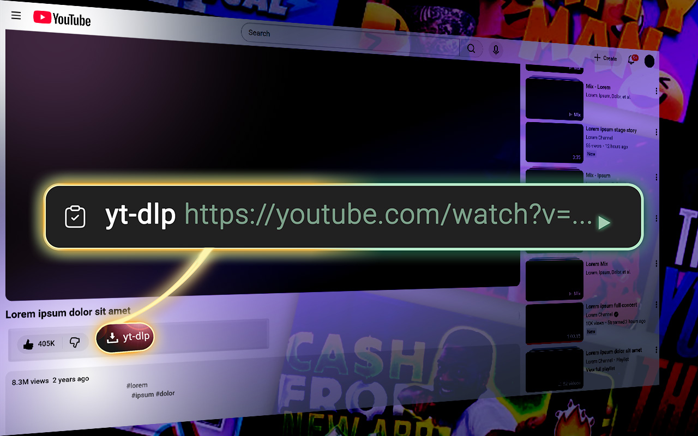

The button generates a **yt-dlp** command straight on a YouTube page. 

## Installation

 

## On YouTube

A new button appears below the video, next to the action row (Like, Share, etc.). 

Click the **yt-dlp** button to copy the command for the current video. Use the optional **In** and **Out** buttons to set start and end times from the current playback position.
